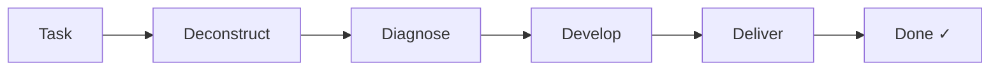
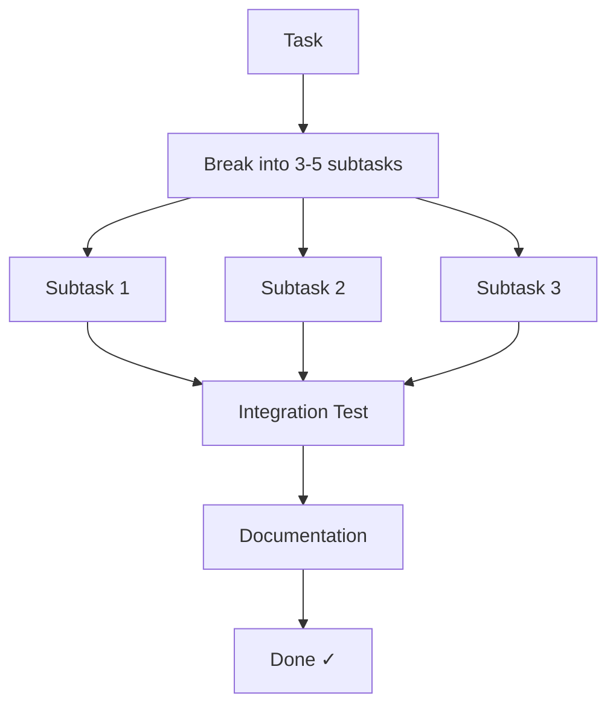
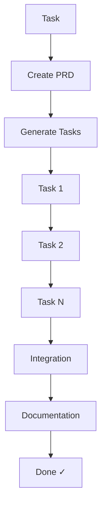

# Core System Overview

Samuel (Artificial Intelligence Coding Framework) is built on a simple but powerful architecture designed for progressive adoption and cross-tool compatibility.

---

## Architecture

```text
┌─────────────────────────────────────────────────────────────┐
│                      Your Project                           │
├─────────────────────────────────────────────────────────────┤
│                                                             │
│  ┌─────────────┐    ┌──────────────────────────────────┐   │
│  │  CLAUDE.md  │    │           .claude/                │   │
│  │             │    │                                    │   │
│  │  • Commands │    │  ├── skills/ (language, framework, │   │
│  │  • Guards   │    │  │          workflow skills)       │   │
│  │  • Methods  │    │  └── auto/ (autonomous loop state) │   │
│  │             │    │                                    │   │
│  └─────────────┘    └──────────────────────────────────┘   │
│        ↑                           ↑                        │
│        └───────────────────────────┘                        │
│                    References                               │
└─────────────────────────────────────────────────────────────┘
```

---

## Core Components

### CLAUDE.md - The Brain

The main instruction file loaded by AI assistants. Contains:

| Section | Purpose |
|---------|---------|
| **Operations** | Commands for setup, testing, building |
| **Boundaries** | Files/actions AI should not modify |
| **Quick Reference** | Task classification, emergency links |
| **Guardrails** | 35+ testable rules |
| **4D Methodology** | ATOMIC/FEATURE/COMPLEX modes |
| **SDLC** | Software Development Lifecycle stages |
| **Context System** | How `.claude/` directory works |
| **Anti-Patterns** | What to avoid |

**Size**: ~500 lines (optimized for token efficiency)

[:octicons-arrow-right-24: Learn about CLAUDE.md](claude-md.md)

---

### .claude/ Directory - The Memory

Project-specific context that grows over time:

```text
.claude/
├── skills/                # Agent Skills (language, framework, workflow)
│   ├── go-guide/          # 21 language guide skills
│   ├── react/             # 33 framework skills
│   ├── create-prd/        # 23 workflow skills
│   ├── auto/              # Autonomous loop skill
│   └── ...
├── auto/                  # Autonomous loop state (generated by samuel auto init)
│   ├── prd.json           # Machine-readable task state
│   ├── progress.md       # Learnings journal
│   ├── prompt.md          # Iteration prompt
│   └── discovery-prompt.md # Discovery prompt (pilot mode)
└── settings.local.json    # Claude Code local settings (gitignored)
```

**Loading Protocol**:

1. **Session Start**: AI loads CLAUDE.md → checks per-folder CLAUDE.md
2. **During Work**: Language guide loads based on file extensions
3. **Complex Features**: Workflows and framework skills loaded on-demand
4. **Autonomous Mode**: Reads prd.json, progress.md for task selection

[:octicons-arrow-right-24: Learn about .claude directory](agent-directory.md)

---

## The 3 Modes

AI auto-detects which mode based on task complexity:

### ATOMIC Mode

**For**: Bug fixes, small features (<5 files)



- Direct implementation
- Quick validation
- One commit

### FEATURE Mode

**For**: New components, API endpoints (5-10 files)



- Break into subtasks
- Sequential implementation
- Multiple commits

### COMPLEX Mode

**For**: New subsystems, architecture (>10 files)



- PRD workflow (optional but recommended)
- Full task breakdown
- Staged delivery

[:octicons-arrow-right-24: Learn the Methodology](methodology.md)

---

## The 4D Methodology

Every task follows four phases:

| Phase | Purpose | Key Question |
|-------|---------|--------------|
| **Deconstruct** | Break down the task | What's the minimal change? |
| **Diagnose** | Identify risks | Will this break anything? |
| **Develop** | Implement with tests | Does it meet guardrails? |
| **Deliver** | Validate and commit | Is it ready for production? |

[:octicons-arrow-right-24: Deep dive into 4D](methodology.md)

---

## Guardrails System

35+ testable rules across categories:

<div class="grid cards" markdown>

-   :material-code-braces:{ .lg .middle } **Code Quality**

    ---

    - Functions ≤50 lines
    - Files ≤300 lines
    - Complexity ≤10
    - All exports typed

-   :material-shield-lock:{ .lg .middle } **Security**

    ---

    - Input validation
    - Parameterized queries
    - No hardcoded secrets
    - Dependency auditing

-   :material-test-tube:{ .lg .middle } **Testing**

    ---

    - >80% business logic
    - >60% overall
    - Regression tests
    - No flaky tests

-   :material-git:{ .lg .middle } **Git**

    ---

    - Conventional commits
    - Atomic changes
    - No direct to main
    - All tests pass

</div>

[:octicons-arrow-right-24: All Guardrails](guardrails.md)

---

## Language Guides

Auto-loaded based on file extensions:

| Language | Extensions | Guide |
|----------|------------|-------|
| TypeScript | `.ts`, `.tsx`, `.js`, `.jsx` | [typescript.md](../languages/typescript.md) |
| Python | `.py` | [python.md](../languages/python.md) |
| Go | `.go` | [go.md](../languages/go.md) |
| Rust | `.rs` | [rust.md](../languages/rust.md) |
| Kotlin | `.kt`, `.kts` | [kotlin.md](../languages/kotlin.md) |

**No manual selection needed** - AI detects and loads automatically.

---

## Workflows

On-demand workflows for complex tasks:

| Workflow | When to Use |
|----------|-------------|
| [Initialize Project](../workflows/initialize-project.md) | New or existing project setup |
| [Create PRD](../workflows/create-prd.md) | Plan complex features |
| [Generate Tasks](../workflows/generate-tasks.md) | Break PRD into tasks |
| [Troubleshooting](../workflows/troubleshooting.md) | Debug systematically |
| [Generate AGENTS.md](../workflows/generate-agents-md.md) | Cross-tool compatibility |
| [Create Skill](../workflows/create-skill.md) | Create portable Agent Skills |
| [Auto](../workflows/auto.md) | Autonomous AI coding loop |
| [Algorithmic Art](../workflows/algorithmic-art.md) | Generative art with p5.js |
| [Doc Co-Authoring](../workflows/doc-coauthoring.md) | Collaborative document writing |
| [Frontend Design](../workflows/frontend-design.md) | Design-driven frontend interfaces |
| [MCP Builder](../workflows/mcp-builder.md) | MCP server development guide |
| [Theme Factory](../workflows/theme-factory.md) | Theme styling for artifacts |
| [Web Artifacts Builder](../workflows/web-artifacts-builder.md) | React/TypeScript/shadcn toolchain |
| [Web App Testing](../workflows/webapp-testing.md) | Playwright-based web testing |

---

## Progressive Growth

The system grows with your project:

```
Day 1:     CLAUDE.md + .claude/ templates only
           ↓
Week 1:    .claude/project.md created (tech stack)
           ↓
Month 1:   .claude/patterns.md populated (conventions)
           ↓
Ongoing:   .claude/memory/ captures decisions
```

!!! tip "Don't Over-Document"

    Let documentation emerge naturally. Don't create files preemptively.

---

## Cross-Tool Compatibility

Works with any AI coding assistant:

| Tool | Primary File | Fallback |
|------|--------------|----------|
| **Claude Code** | CLAUDE.md | AGENTS.md |
| **Cursor** | AGENTS.md | CLAUDE.md |
| **OpenAI Codex** | AGENTS.md | - |
| **GitHub Copilot** | AGENTS.md | - |
| **Google Jules** | AGENTS.md | - |

Setup: `ln -s CLAUDE.md AGENTS.md`

[:octicons-arrow-right-24: Cross-Tool Setup](../reference/cross-tool.md)

---

## Next Steps

<div class="grid cards" markdown>

-   :material-file-document:{ .lg .middle } **CLAUDE.md Deep Dive**

    ---

    Understand the main instruction file.

    [:octicons-arrow-right-24: CLAUDE.md](claude-md.md)

-   :material-shield:{ .lg .middle } **All Guardrails**

    ---

    Review the 35+ testable rules.

    [:octicons-arrow-right-24: Guardrails](guardrails.md)

</div>
