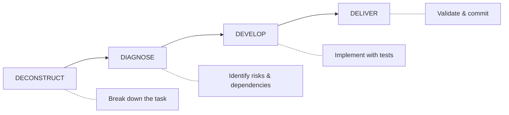

# Samuel

**Artificial Intelligence Coding Framework**

Build smarter, faster, and more scalable software.

[:material-rocket-launch: Get Started](getting-started/quick-start.md){ .md-button .md-button--primary }
[:material-github: View on GitHub](https://github.com/ar4mirez/samuel){ .md-button }

---

## What is Samuel?

Samuel (Artificial Intelligence Coding Framework) is an **opinionated AI development framework** designed for professional software teams. It provides guardrails, language guides, and workflows that help AI coding assistants produce consistent, high-quality code.

<div class="grid cards" markdown>

-   :material-shield-check:{ .lg .middle } **35+ Guardrails**

    ---

    Testable rules for code quality, security, testing, and git practices. Not vague suggestions - specific, enforceable standards.

    [:octicons-arrow-right-24: View Guardrails](core/guardrails.md)

-   :material-code-braces:{ .lg .middle } **21 Language Guides**

    ---

    All major languages from TypeScript to Zig. Auto-loading based on file extensions - no manual configuration needed.

    [:octicons-arrow-right-24: Language Guides](languages/index.md)

-   :material-layers:{ .lg .middle } **33 Framework Guides**

    ---

    Framework-specific patterns for React, Django, Rails, Spring Boot, and 29 more. Deep integration guidance.

    [:octicons-arrow-right-24: Framework Guides](frameworks/index.md)

-   :material-cog:{ .lg .middle } **24 Workflows**

    ---

    Planning, quality, maintenance, utility, autonomous, and community workflows including PRD creation, code review, security audit, autonomous loops, and more.

    [:octicons-arrow-right-24: Explore Workflows](workflows/index.md)

-   :material-console:{ .lg .middle } **CLI-Powered**

    ---

    Full-featured CLI with 14 commands: search, info, add, remove, diff, config, skill, auto, sync, and more. Discover components before installing.

    [:octicons-arrow-right-24: CLI Reference](reference/cli.md)

-   :material-tools:{ .lg .middle } **Cross-Tool Compatible**

    ---

    Works with Claude Code, Cursor, Codex, Copilot, and any AI assistant that reads AGENTS.md.

    [:octicons-arrow-right-24: Cross-Tool Setup](reference/cross-tool.md)

</div>

---

## Quick Start

=== "CLI (Recommended)"

    ```bash
    # 1. Install the CLI
    brew tap ar4mirez/tap && brew install samuel
    # Or: curl -sSL https://raw.githubusercontent.com/ar4mirez/samuel/main/install.sh | sh

    # 2. Initialize your project
    cd your-project
    samuel init

    # 3. Discover and add components
    samuel search react              # Find components
    samuel info fw react --preview   # Preview before installing
    samuel add framework react       # Install what you need

    # 4. Verify installation
    samuel doctor
    ```

=== "Manual Setup"

    ```bash
    # 1. Copy to your project
    cp -r /path/to/samuel/{CLAUDE.md,.claude} ./

    # 2. (Optional) For cross-tool compatibility
    ln -s CLAUDE.md AGENTS.md

    # 3. Start coding with AI - guardrails apply automatically!
    ```

**The system works immediately:**

- [x] AI loads CLAUDE.md automatically (500 lines of guardrails + operations)
- [x] Language guides auto-load based on file extensions
- [x] **14 CLI commands** for component discovery and management
- [x] Progressive - starts minimal, grows with your project

[:octicons-arrow-right-24: Full Quick Start Guide](getting-started/quick-start.md)

---

## The 3 Modes

AI auto-detects which mode to use based on your request:

=== "ATOMIC"

    **For:** Bug fixes, small features (<5 files)

    ```
    "Fix the login button alignment"
    ```

    - Direct implementation
    - Quick validation
    - One commit

=== "FEATURE"

    **For:** New components, API endpoints (5-10 files)

    ```
    "Add user profile editing with avatar upload"
    ```

    - Break into 3-5 subtasks
    - Implement sequentially
    - Integration testing

=== "COMPLEX"

    **For:** New subsystems, architecture changes (>10 files)

    ```
    @.claude/skills/create-prd/SKILL.md
    "Build user authentication with OAuth"
    ```

    - Create PRD (Product Requirements Document)
    - Generate task breakdown
    - Step-by-step implementation

---

## Key Guardrails

!!! warning "Security (CRITICAL)"

    - All inputs validated before processing
    - Parameterized queries only (no string concatenation)
    - No secrets in code
    - Dependencies checked for vulnerabilities + licenses

!!! info "Code Quality"

    - Functions ≤50 lines
    - Files ≤300 lines
    - Cyclomatic complexity ≤10
    - All exports have types/docs

!!! success "Testing (CRITICAL)"

    - >80% coverage for business logic
    - >60% overall coverage
    - Tests for all public APIs
    - Regression tests for bugs

[:octicons-arrow-right-24: View All 35+ Guardrails](core/guardrails.md)

---

## The 4D Methodology



[:octicons-arrow-right-24: Learn the 4D Methodology](core/methodology.md)

---

## What's New in v2.0.0

- **Autonomous AI Coding Loop** - Ralph Wiggum methodology for unattended AI-driven development (`samuel auto`)
- **Native `.claude/` Integration** - Migrated from `.agent/` to `.claude/` native directory
- **Agent Skills Standard** - Portable skill modules across 25+ AI tools (`samuel skill`)
- **Per-folder CLAUDE.md** - Hierarchical instructions with folder-level overrides

[:octicons-arrow-right-24: Full Changelog](reference/changelog.md)

---

## System Stats

| Metric | Value |
|--------|-------|
| **Version** | 2.0.0 |
| **Status** | Production Ready |
| **AGENTS.md** | Compatible |
| **Total Files** | 70+ markdown files |
| **CLAUDE.md** | ~500 lines |
| **CLI Commands** | 14 (init, search, info, add, remove, list, config, diff, update, doctor, version, skill, auto, sync) |
| **Language Guides** | 21 (all major programming languages) |
| **Framework Guides** | 33 (across 11 language families) |
| **Workflows** | 24 (planning, quality, maintenance, utility, autonomous, community) |
| **Guardrails** | 35+ testable rules |

---

## Philosophy

> Small, validated changes. Quality enforced. Documentation grows organically.

This framework embraces:

- **Atomic commits** - One logical change per commit
- **Progressive disclosure** - Start minimal, grow with your project
- **Cross-tool compatibility** - Works with any AI coding assistant
- **Testable standards** - Not vague suggestions, but enforceable rules

---

<div class="grid cards" markdown>

-   :material-book-open-variant:{ .lg .middle } **Documentation**

    ---

    Comprehensive guides for every feature.

    [:octicons-arrow-right-24: Read the Docs](getting-started/quick-start.md)

-   :material-github:{ .lg .middle } **GitHub**

    ---

    Star, fork, or contribute.

    [:octicons-arrow-right-24: View Repository](https://github.com/ar4mirez/samuel)

-   :material-bug:{ .lg .middle } **Issues**

    ---

    Report bugs or request features.

    [:octicons-arrow-right-24: Open Issue](https://github.com/ar4mirez/samuel/issues)

-   :material-chat:{ .lg .middle } **Discussions**

    ---

    Ask questions and share ideas.

    [:octicons-arrow-right-24: Join Discussion](https://github.com/ar4mirez/samuel/discussions)

</div>
