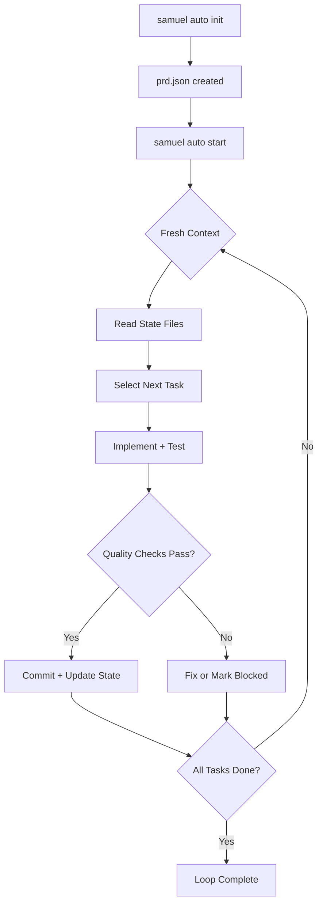

# Autonomous AI Coding Loop

> **Purpose**: Enable unattended AI-driven development using the Ralph Wiggum methodology. An AI agent independently selects, implements, and commits tasks from a structured task list (prd.json), running across multiple fresh context windows.

---

## When to Use

| Trigger | Description |
|---------|-------------|
| **AFK Development** | Run AI agents unattended while you're away |
| **Batch Task Execution** | Process many small tasks from a generated task list |
| **Post-PRD Automation** | After creating a PRD and task breakdown, automate implementation |
| **COMPLEX Mode Extension** | Extend the 4D COMPLEX mode with autonomous execution |
| **Prototype Sprints** | Rapidly scaffold or prototype a feature set |

---

## Overview

The autonomous loop runs AI agents in a cycle, where each iteration:

1. Starts with **fresh context** (no conversation history dependency)
2. Reads project state from files (prd.json, progress.md, CLAUDE.md)
3. Selects and implements **one task**
4. Commits changes and updates state
5. Documents learnings for future iterations

Continuity is maintained through **persistent files**, not conversation history.



---

## Core Principles

### 1. Fresh Context Per Iteration

Each cycle begins with a clean AI context window. The AI agent reconstructs understanding from: git history, prd.json (task state), progress.md (learnings), and CLAUDE.md/AGENTS.md (project guardrails).

### 2. Right-Sized Decomposition

Tasks must be completable within a single context window. Break large features into focused, atomic steps. If a task is too big, split it before starting.

### 3. Feedback-Driven Quality

Automated checks (tests, linting, type checking) serve as guardrails:

- Quality checks must pass before committing
- Failed checks provide feedback for the next attempt
- Pre-commit hooks catch regressions

### 4. Knowledge Persistence

Learnings accumulate in `progress.md` across iterations:

- Architectural decisions
- Gotchas and edge cases
- Patterns discovered
- Error resolutions

### 5. Agent-Driven Prioritization

The AI agent chooses which task to work on based on:

- Priority level (critical > high > medium > low)
- Dependency resolution (prerequisites must be complete)
- Task ID ordering (lower IDs first when priority is equal)

---

## Workflow

### Setup (One-Time)

```bash
# 1. Create PRD and task breakdown (existing Samuel workflow)
# Use .claude/skills/create-prd/SKILL.md
# Use .claude/skills/generate-tasks/SKILL.md

# 2. Initialize autonomous loop
samuel auto init --prd .claude/tasks/0001-prd-feature.md

# 3. Review generated files
cat .claude/auto/prd.json      # Task list in JSON
cat .claude/auto/prompt.md     # Iteration prompt
cat .claude/auto/prompt.md     # Iteration prompt
```

### Running the Loop

```bash
# Start the loop (will prompt for confirmation)
samuel auto start

# Start with custom iteration count
samuel auto start --iterations 20

# Skip confirmation
samuel auto start --yes

# Dry run (see what would happen)
samuel auto start --dry-run
```

### Pilot Mode (Zero Setup)

```bash
# Fully autonomous — no PRD or task files needed
samuel auto pilot

# Customize iterations, focus, and discovery frequency
samuel auto pilot --iterations 20 --focus testing
samuel auto pilot --discover-interval 3 --max-tasks 5

# Dry run to preview without executing
samuel auto pilot --dry-run
```

### Monitoring

```bash
# Check progress
samuel auto status

# View recent learnings
tail -20 .claude/auto/progress.md

# List all tasks
samuel auto task list
```

### Manual Intervention

```bash
# Mark a task as completed manually
samuel auto task complete 1.1

# Skip a task
samuel auto task skip 2.3

# Reset a task to pending
samuel auto task reset 1.1

# Add a new task
samuel auto task add "3.0" "New parent task"
```

---

## Per-Iteration Protocol

When operating in autonomous mode, the AI follows these steps exactly:

| Step | Action | Details |
|------|--------|---------|
| 1 | **Read Context** | CLAUDE.md, progress.md, prd.json |
| 2 | **Select Task** | Filter pending → resolve dependencies → sort by priority |
| 3 | **Implement** | Update status to in_progress, write code + tests |
| 4 | **Quality Check** | Run all commands in `config.quality_checks` |
| 5 | **Commit** | Conventional commit: `type(scope): task ID - description` |
| 6 | **Update State** | Set status to completed, record commit SHA and iteration |
| 7 | **Document** | Append learnings to progress.md |

---

## File Formats

### prd.json

Machine-readable task state:

```json
{
  "version": "1.0",
  "project": {
    "name": "project-name",
    "description": "Project description",
    "source_prd": ".claude/tasks/0001-prd-feature.md",
    "created_at": "2026-02-11T10:00:00Z",
    "updated_at": "2026-02-11T12:00:00Z"
  },
  "config": {
    "max_iterations": 50,
    "quality_checks": ["go test ./...", "go vet ./..."],
    "ai_tool": "claude",
    "ai_prompt_file": ".claude/auto/prompt.md",
    "sandbox": "none"
  },
  "tasks": [
    {
      "id": "1.0",
      "title": "Database Setup",
      "status": "completed",
      "priority": "critical",
      "complexity": "medium",
      "depends_on": [],
      "commit_sha": "abc1234",
      "iteration": 1
    }
  ],
  "progress": {
    "total_tasks": 10,
    "completed_tasks": 3,
    "status": "running"
  }
}
```

### Task Statuses

| Status | Description |
|--------|-------------|
| `pending` | Not yet started (available for selection) |
| `in_progress` | Currently being worked on |
| `completed` | Successfully finished with commit |
| `skipped` | Deliberately skipped (counts as "done" for dependencies) |
| `blocked` | Cannot proceed (needs human intervention) |

### progress.md

Append-only log with structured entries:

```text
[2026-02-11T10:30:00Z] [iteration:1] [task:1.0] STARTED: Database setup
[2026-02-11T10:35:00Z] [iteration:1] [task:1.0] COMPLETED: Created schema
[2026-02-11T10:35:00Z] [iteration:1] [task:1.0] LEARNING: Use explicit indexes
[2026-02-11T10:36:00Z] [iteration:1] QUALITY_CHECK: go test ./... PASSED
[2026-02-11T10:36:00Z] [iteration:1] COMMIT: abc1234 "feat(db): task 1.0"
```

Entry types: `STARTED`, `COMPLETED`, `ERROR`, `LEARNING`, `QUALITY_CHECK`, `COMMIT`

---

## Tips for Success

1. **Start supervised, then go AFK**: Run a few iterations manually to verify the prompt and quality checks work correctly. Then let it run unattended.

2. **Prioritize risky tasks**: Have the AI tackle architectural decisions and integration points first. Reserve human oversight for critical foundations.

3. **Define quality level**: Specify whether code is prototype, production, or library quality so the agent matches appropriate standards.

4. **Take small steps**: Break work into focused tasks. Each should produce one commit. Smaller tasks = better feedback loops.

5. **Use quality gates**: Tests, linting, and type checking catch regressions before they compound across iterations.

6. **Review progress.md**: The learnings journal accumulates valuable insights. Read it periodically to catch issues early.

---

## Error Recovery

When the AI agent encounters errors:

1. **Within iteration**: Try to fix within the current iteration
2. **Mark as blocked**: If unfixable, set status to "blocked" with description
3. **Document in progress.md**: Append error details as LEARNING entry
4. **Fresh context helps**: The next iteration starts clean and may succeed where the previous one got stuck

When the loop itself fails:

```bash
samuel auto status              # Check what happened
samuel auto task list           # See task states
samuel auto task reset 1.1      # Reset a stuck task
samuel auto start               # Resume the loop
```

---

## Integration with 4D Methodology

The auto loop extends the existing COMPLEX mode workflow:

```text
Standard COMPLEX Mode:
  create-prd → generate-tasks → manual implementation (HITL)

With Auto Loop (PRD-based):
  create-prd → generate-tasks → samuel auto init → samuel auto start (autonomous)

With Pilot Mode (zero setup):
  samuel auto pilot (discovers and implements autonomously)
```

The human can re-enter the loop at any point by stopping the process and returning to manual task-by-task implementation.

---

## Supported AI Tools

| Tool | Status | Notes |
|------|--------|-------|
| `claude` | Supported | Default. Uses `claude --print --dangerously-skip-permissions` |
| `amp` | Supported | Uses `amp --prompt-file` |
| `codex` | Supported | Uses `codex --prompt-file --auto` |
| `cursor` | Planned | CLI autonomous mode not yet available |

Set the tool with `--ai-tool` flag or `AI_TOOL` environment variable.

---

## See Also

- [CLI Reference: auto](../reference/cli.md#auto) - Full command reference
- [Create PRD](create-prd.md) - Define requirements before automating
- [Generate Tasks](generate-tasks.md) - Break down PRD into implementable tasks
- [4D Methodology](../core/methodology.md) - COMPLEX mode workflow
