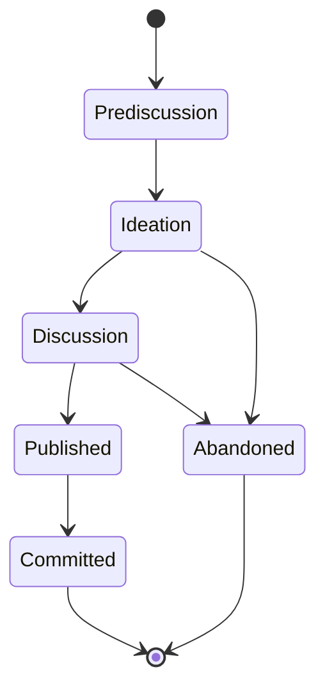

# Create RFD Workflow

> **Purpose**: Capture ideas, explore options, and document decisions before implementation
>
> **Use When**: Proposing new approach, exploring options, need team input, documenting decisions

## Philosophy

> "Ideas should be timely rather than polished."
> — Oxide Computer Company, RFD 1

RFDs (Requests for Discussion) are inspired by the IETF's RFC tradition. The key insight is that sharing incomplete ideas early leads to better outcomes than polishing in isolation.

**Core principles:**

- Share early, refine together
- Document options, not just decisions
- Capture context for future readers
- Build consensus before implementation

## When to Use RFD vs PRD

| Scenario | Use RFD | Use PRD |
|----------|---------|---------|
| "Should we use Redis or PostgreSQL for sessions?" | :white_check_mark: | |
| "Build session management with Redis" | | :white_check_mark: |
| "Exploring authentication approaches" | :white_check_mark: | |
| "Implement OAuth with Google and GitHub" | | :white_check_mark: |
| "Should we adopt a new framework?" | :white_check_mark: | |
| Multiple valid options, need discussion | :white_check_mark: | |
| Requirements clear, need implementation plan | | :white_check_mark: |

**Key distinction:**

- **RFD** = "Why" and "What options" (explore, discuss, decide)
- **PRD** = "What" and "How" (plan, implement, deliver)

**Typical flow:**

```
Idea → RFD (explore options) → Decision → PRD (define implementation) → Tasks → Code
```

## RFD States (Lifecycle)



| State | Description | Location |
|-------|-------------|----------|
| **Prediscussion** | Very early, author still forming idea | `.agent/rfd/` |
| **Ideation** | Ready for informal feedback, not finalized | `.agent/rfd/` |
| **Discussion** | Open for team discussion, seeking consensus | `docs/rfd/` |
| **Published** | Decision made, documented for reference | `docs/rfd/` |
| **Committed** | Implemented, part of the codebase | `docs/rfd/` |
| **Abandoned** | Proposal rejected or superseded | `docs/rfd/` |

## How to Use

### Basic Usage

```
@.agent/workflows/create-rfd.md

Explore options for caching strategy in our API
```

### With Context

```
@.agent/workflows/create-rfd.md

I'm considering authentication approaches for our new service.
We could use JWT tokens, session cookies, or OAuth. The service needs
to support both web and mobile clients.
```

### State Promotion

```
Promote RFD 0042 to Discussion
```

```
Mark RFD 0042 as Published - we're going with Option A
```

### RFD to PRD Transition

```
We've decided on Option B (Redis) for RFD 0044. Create a PRD for implementation.
```

## RFD Structure

Every RFD includes these sections:

### Frontmatter

```yaml
---
rfd: 0042
title: API Caching Strategy
authors:
  - name: Your Name
state: Ideation
labels: [architecture, performance]
created: 2026-01-15
updated: 2026-01-15
discussion: null
related_prd: null
---
```

### Sections

| Section | Purpose |
|---------|---------|
| **Summary** | One paragraph overview |
| **Problem Statement** | What problem we're solving |
| **Background** | Context readers need |
| **Options Considered** | Each option with pros/cons |
| **Proposal** | Recommended approach (or "seeking feedback") |
| **Implementation Considerations** | High-level technical notes |
| **Security Considerations** | Security implications |
| **Compatibility** | Breaking changes, migration |
| **Open Questions** | Questions needing answers |
| **References** | Related RFDs, external resources |

## Embedded Mode

During regular development, Claude will suggest creating an RFD when it detects:

- User asks "Should we use X or Y?"
- Discussion involves 2+ approaches with pros/cons
- Architectural decision point
- Significant deviation from existing patterns

**Example suggestion:**

> I notice we're discussing multiple approaches for authentication. Would you like me to create an RFD to formally document these options? This will help capture the decision for future reference.
>
> Shall I create RFD 0045: Authentication Strategy?

## File Organization

```
project/
├── .agent/rfd/           # Private RFDs (Prediscussion, Ideation)
│   └── 0042-rfd-api-caching.md
├── docs/rfd/             # Public RFDs (Discussion, Published, Committed)
│   ├── index.md          # RFD overview
│   └── 0001.md           # Individual RFDs
└── rfd-index.yaml        # Master index
```

## Tips for Good RFDs

### Content Quality

- **Be honest about tradeoffs**: Every option has cons
- **Include rejected options**: Future readers need to know what was considered
- **Quantify when possible**: "50ms vs 200ms" beats "faster vs slower"
- **Link to evidence**: External resources, benchmarks, case studies

### Process Quality

- **Share early**: Don't polish in isolation
- **Keep scope focused**: One decision per RFD
- **Update as you learn**: RFDs can evolve during discussion
- **Close the loop**: Move to Published/Committed/Abandoned

### Common Mistakes

- :x: Only documenting the chosen option
- :x: Waiting until decision is made to write
- :x: Scope creep (multiple decisions in one RFD)
- :x: Abandoning without explanation
- :x: Never updating state (stale "Discussion" RFDs)

## When NOT to Use RFD

Skip RFD for:

- **Obvious decisions**: Only one viable option
- **Small scope**: Won't affect others, easily reversible
- **Already decided**: Discussion already happened elsewhere
- **Implementation details**: HOW not WHAT (use PRD instead)
- **Urgent fixes**: Document post-hoc if needed

## Related Workflows

| Workflow | Relationship |
|----------|--------------|
| [Create PRD](create-prd.md) | Creates implementation plan after RFD decision |
| [Document Work](document-work.md) | Can identify mini-RFDs worth promoting |
| [Generate Tasks](generate-tasks.md) | Breaks down PRD (which may reference RFD) |

## Learn More

- [RFD Overview](../rfd/index.md) - Browse all RFDs
- [Oxide's RFD 1](https://rfd.shared.oxide.computer/rfd/0001) - Original inspiration
- [Create PRD Workflow](create-prd.md) - For implementation planning
