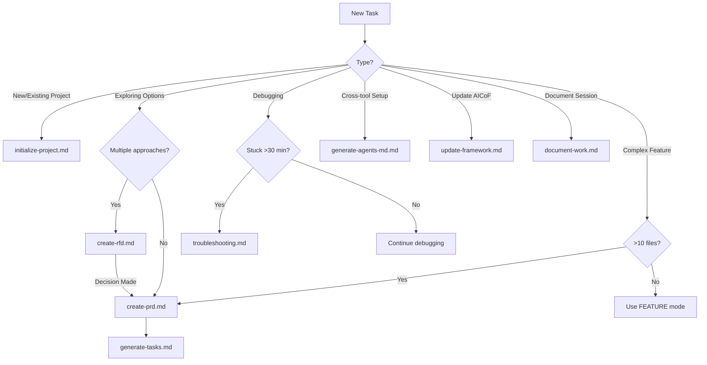

# Workflows

On-demand workflows covering the entire software development lifecycle.

---

## Overview

Workflows are structured processes for handling specific types of tasks. They're loaded on-demand when you need them.

## Workflow Categories

| Category | Workflows | Purpose |
|----------|-----------|---------|
| **Planning** | initialize-project, create-rfd, create-prd, generate-tasks | Define and break down work |
| **Quality** | code-review, security-audit, testing-strategy | Validate and improve code |
| **Maintenance** | cleanup-project, refactoring, dependency-update, update-framework | Keep codebase healthy |
| **Utility** | troubleshooting, generate-agents-md, document-work | Support and documentation |

---

## All Workflows

| Workflow | Purpose | When to Use |
|----------|---------|-------------|
| [Initialize Project](initialize-project.md) | Set up new or existing projects | Starting a project |
| [Create RFD](create-rfd.md) | Explore options and document decisions | Evaluating approaches |
| [Create PRD](create-prd.md) | Plan complex features | COMPLEX mode (>10 files) |
| [Generate Tasks](generate-tasks.md) | Break PRD into actionable tasks | After PRD created |
| [Code Review](code-review.md) | Validate against guardrails | Before commits, PR reviews |
| [Security Audit](security-audit.md) | OWASP Top 10, vulnerability scan | Pre-production, monthly |
| [Testing Strategy](testing-strategy.md) | Plan test coverage | After features, debt sprints |
| [Cleanup Project](cleanup-project.md) | Prune unused guides | Post-init, quarterly |
| [Refactoring](refactoring.md) | Technical debt remediation | Guardrail violations |
| [Dependency Update](dependency-update.md) | Safe dependency updates | Monthly, vulnerabilities |
| [Update Framework](update-framework.md) | Update AICoF version | New releases, maintenance |
| [Troubleshooting](troubleshooting.md) | Debug systematically | Stuck >30 minutes |
| [Generate AGENTS.md](generate-agents-md.md) | Cross-tool compatibility | Multi-tool teams |
| [Document Work](document-work.md) | Capture patterns and decisions | End of session, handoffs |

---

## How to Use Workflows

Invoke a workflow by referencing it:

```
@.agent/workflows/create-prd.md

Build a user authentication system with OAuth support
```

The AI will:

1. Load the workflow instructions
2. Follow the structured process
3. Ask clarifying questions if needed
4. Complete the workflow steps

---

## Workflow Decision Tree



---

## When NOT to Use Workflows

Workflows add structure but also overhead. Skip them for:

- **Simple bug fixes** - Use ATOMIC mode directly
- **Small features** - Use FEATURE mode directly
- **Quick questions** - Just ask
- **Code review** - Direct review without workflow

!!! tip "Rule of Thumb"

    If the task affects <10 files and requirements are clear, skip the PRD workflow.

---

## Workflow Outputs

Each workflow produces specific outputs:

### Initialize Project

**Creates**:

- `.agent/project.md` - Tech stack documentation
- `.agent/patterns.md` - Coding conventions (if patterns found)
- Directory structure recommendations

### Create PRD

**Creates**:

- `.agent/tasks/NNNN-prd-feature-name.md` - Product Requirements Document

**Contains**:

- Introduction/Overview
- Goals
- User Stories
- Functional Requirements
- Non-Goals
- Technical Considerations
- Guardrails Affected
- Success Metrics

### Generate Tasks

**Creates**:

- `.agent/tasks/tasks-NNNN-prd-feature-name.md` - Task breakdown

**Contains**:

- Numbered task list
- Dependencies
- Verification steps
- Estimated complexity

### Troubleshooting

**Creates** (optional):

- `.agent/memory/YYYY-MM-DD-issue-name.md` - Solution documentation

**Contains**:

- Problem description
- Root cause
- Solution
- Prevention steps

### Generate AGENTS.md

**Creates**:

- `AGENTS.md` - Cross-tool compatible instructions

### Document Work

**Creates/Updates**:

- `.agent/patterns.md` - Coding patterns discovered
- `.agent/memory/YYYY-MM-DD-topic.md` - Decision logs
- `.agent/state.md` - Current work status

### Update Framework

**Updates**:

- `CLAUDE.md` - Latest version
- `.agent/` - New guides and workflows

---

## Chaining Workflows

Workflows can be chained for complex tasks:

```
1. @.agent/workflows/create-rfd.md (optional)
   → Explore options when approach is unclear

2. @.agent/workflows/create-prd.md
   → Creates PRD document (after RFD decision, if used)

3. @.agent/workflows/generate-tasks.md
   → Creates task breakdown from PRD

4. Implement tasks one by one
   → Each task uses ATOMIC or FEATURE mode

5. @.agent/workflows/document-work.md
   → Capture patterns and decisions from implementation
```

**RFD → PRD Flow**: When exploring options, use create-rfd first. Once a decision is made, use create-prd to plan the implementation.

---

## Planning Workflows

<div class="grid cards" markdown>

-   :material-folder-plus:{ .lg .middle } **Initialize Project**

    ---

    Set up new projects or analyze existing ones.

    [:octicons-arrow-right-24: Initialize Project](initialize-project.md)

-   :material-head-question:{ .lg .middle } **Create RFD**

    ---

    Explore options and document decisions before implementation.

    [:octicons-arrow-right-24: Create RFD](create-rfd.md)

-   :material-file-document:{ .lg .middle } **Create PRD**

    ---

    Plan complex features with structured requirements.

    [:octicons-arrow-right-24: Create PRD](create-prd.md)

-   :material-format-list-numbered:{ .lg .middle } **Generate Tasks**

    ---

    Break PRDs into actionable task lists.

    [:octicons-arrow-right-24: Generate Tasks](generate-tasks.md)

</div>

---

## Quality Workflows

<div class="grid cards" markdown>

-   :material-check-circle:{ .lg .middle } **Code Review**

    ---

    Systematic validation against guardrails before committing.

    [:octicons-arrow-right-24: Code Review](code-review.md)

-   :material-shield-check:{ .lg .middle } **Security Audit**

    ---

    OWASP Top 10, vulnerability scanning, secrets detection.

    [:octicons-arrow-right-24: Security Audit](security-audit.md)

-   :material-test-tube:{ .lg .middle } **Testing Strategy**

    ---

    Plan and achieve test coverage targets.

    [:octicons-arrow-right-24: Testing Strategy](testing-strategy.md)

</div>

---

## Maintenance Workflows

<div class="grid cards" markdown>

-   :material-broom:{ .lg .middle } **Cleanup Project**

    ---

    Prune unused guides and reduce .agent/ bloat.

    [:octicons-arrow-right-24: Cleanup Project](cleanup-project.md)

-   :material-wrench:{ .lg .middle } **Refactoring**

    ---

    Structured approach to technical debt remediation.

    [:octicons-arrow-right-24: Refactoring](refactoring.md)

-   :material-package-up:{ .lg .middle } **Dependency Update**

    ---

    Safe and systematic dependency updates.

    [:octicons-arrow-right-24: Dependency Update](dependency-update.md)

-   :material-update:{ .lg .middle } **Update Framework**

    ---

    Update AICoF to latest version while preserving customizations.

    [:octicons-arrow-right-24: Update Framework](update-framework.md)

</div>

---

## Utility Workflows

<div class="grid cards" markdown>

-   :material-bug:{ .lg .middle } **Troubleshooting**

    ---

    Systematic debugging when stuck.

    [:octicons-arrow-right-24: Troubleshooting](troubleshooting.md)

-   :material-tools:{ .lg .middle } **Generate AGENTS.md**

    ---

    Create cross-tool compatible instructions.

    [:octicons-arrow-right-24: Generate AGENTS.md](generate-agents-md.md)

-   :material-notebook:{ .lg .middle } **Document Work**

    ---

    Capture patterns, decisions, and learnings from development.

    [:octicons-arrow-right-24: Document Work](document-work.md)

</div>
